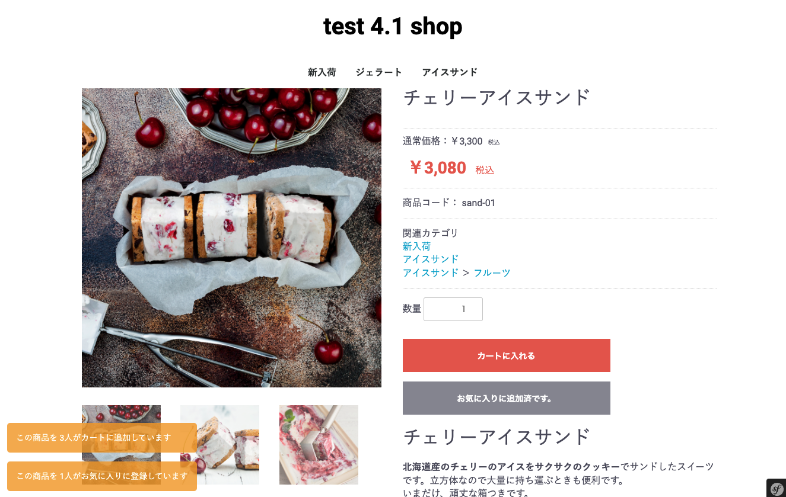

# EC-CUBE4.1用 商品の人気雰囲気演出機能

商品ページに、
- この商品を X人がカートに追加しています
- この商品を X人がお気に入りに登録しています
といった表現を追加するプラグインです。
    
## 仕様

### カートに追加されている件数
過去30日以内に更新のあったカート内から、同一の商品コードが何件存在するかを取得しています。

### お気に入りに登録されている件数
全期間内から、お気に入りに登録されている件数を表示させています。

## 表示時間やカラー等の変更方法

プラグインを有効化すると、`app/template/%theme%` 内に
`/Tiip/asset.twig` , `/Tiip/snipet.twig` というファイルが生成されますのでご自由に編集してください。

```
<script>
const TiipOpt = {
    startTime : 0, {# 表示開始までの時間(ミリ秒 1s = 1000 ) #}
    endTime : 5000, {# 表示終了まで #}
}
</script>
<style>
:root {
  --ttip-card-bg-color: #eda106d1; {# カード背景のカラー（デフォルト：オレンジ[#eda106d1]） #}
  --ttip-card-txt-color: #ffffff; {# カード背景のカラー（デフォルト：ホワイト[#FFFFFFF]） #}
  --ttip-card-timelag: 0.5s; {# カード表示／非表示時の時間差 #}
}
```

## イメージ



# インストール方法

```
cd app/Plugin;
git clone https://github.com/cajiya/ec-cube4_tiip.git;
mv ec-cube4_tiip TheItemIsPopular;
cd ../../;
php bin/console eccube:plugin:install --code="TheItemIsPopular"
```

